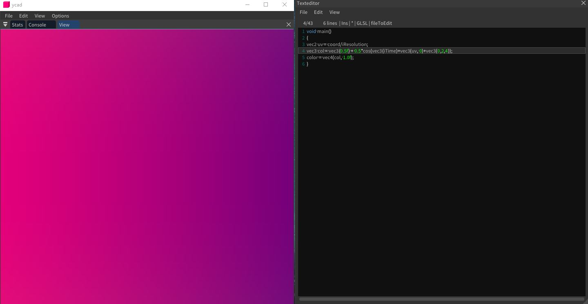

DESCRIPTION
===========================================
This Project is like Shadertoy. Play around with shaders

HOW TO USE
===========================================
1. Build the project
2. Open the Program
3. Type you Shadercode in Texteditor
4. Press Edit>Run

INFORMATION
===========================================
- this is a part of another app (CAD) which is not ready for git
- i implemented this for playing around with SDF's and using it for the bigger project
- there might be some code overhang due to this

TODO - PLANS
===========================================
- No PLANS 

ARCHITECTURE
===========================================
- Renderer does the Render/OpenGL stuff
- in SDF.hpp/SDF.cpp we create the Shader and a simple rect to draw the screen
- Gui Folder contains the simple Gui

DEPENDECIES
===========================================
Following dependcies:
	- doxygen
	- imgui + imgui-spectrum-style
	- GLFW + GLEW
	- GLEQ
	- GLM
	- STB
	- boost::cirular_buffer 1.82

	
HOW TO BUILD
===========================================
- this project has a premake5.lua file. I use clang 15.0.4 (with msys2 on windows)
'''
	premake5 gmake2
	make
'''

LICENSE
===========================================
This projects uses MIT LICENSE.